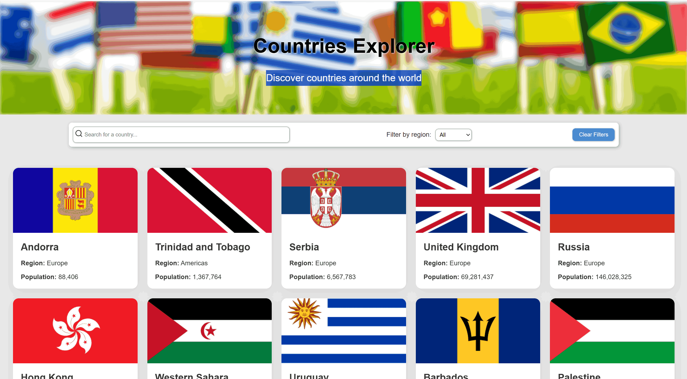

# 🌍 Countries Explorer

A React application that allows users to explore countries, filter by region, and search by name with a smooth UI and skeleton loading effects.

---

## 🚀 How to Run

1. Clone the repository:

```bash
git clone https://github.com/Fatima-Rahmani79/countries-app.git
Navigate to the project folder:

cd countries-app
Install dependencies:

npm install
Run the development server:

npm run dev
Open the app in your browser at http://localhost:5173 (default Vite port).

🌐 API Endpoints Used
The app fetches country data from the REST Countries API:

All countries:
https://restcountries.com/v3.1/all?fields=name,flags,region,population,cca3

Search by name:
https://restcountries.com/v3.1/name/{name}?fields=name,flags,region,population,cca3

Filter by region:
https://restcountries.com/v3.1/region/{region}?fields=name,flags,region,population,cca3

🖼 Screenshots
### Home Page


### Search / Filter Results


✨ Features
Search countries by name

Filter countries by region

Skeleton loading UI

Debounced search (500ms delay)

Error handling with retry

Custom “No results found” UI

Responsive design

👩‍💻 Author
Fatima Rahmani
GitHub: [Fatima-Rahmani79](https://github.com/Fatima-Rahmani79)